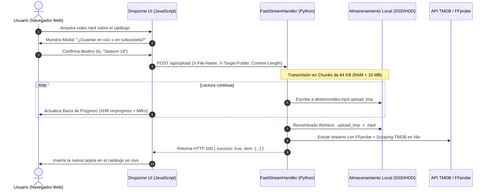

# 📤 FastStream: Drag & Drop Ingestion & Chunked Upload Engine Specification

> **Documento de Arquitectura y Especificación Técnica**  
> **Subproyecto:** FastStream CLI  
> **Versión:** 1.0 (Borrador de Arquitectura)  
> **Fecha:** 22 de Agosto de 2026  

---

## 🎯 1. Objetivo y Visión General

Transformar a **FastStream** de un servidor de transmisión unidireccional (*Streaming HTTP 206*) en un **Hub Multimedia Bidireccional Autónomo**. Permitirá a cualquier usuario en la red local (desde un teléfono móvil, tablet o PC) arrastrar archivos de video o subtítulos directamente al navegador web para:
1. **Alojar el archivo en el directorio raíz** donde se ejecutó FastStream.
2. **Crear o seleccionar subcarpetas organizadas** (ej. `Anime/One Piece (1999)/Season 17/`).
3. **Indexar y enriquecer automáticamente con TMDB/IMDb** sin reiniciar el proceso CLI.

Todo esto cumpliendo la **Regla de Oro de FastStream**: **100% Python Estándar Puro, 0 dependencias externas (`pip`/`npm`), memoria RAM fija (<15 MB) y escritura atómica a disco.**

---

## 🏗️ 2. Comparativa Técnica de Enfoques de Subida

Se evaluaron tres arquitecturas para la implementación de la subida en Python puro:

```
+-----------------------------------------------------------------------------------+
|               COMPARATIVA DE ARQUITECTURAS DE SUBIDA EN FASTSTREAM                |
+-----------------------------------------------------------------------------------+
| Enfoque                | Ventajas                  | Desventajas / Riesgos        |
+------------------------+---------------------------+------------------------------+
| 1. multipart/form-data | Estándar HTML5 antiguo    | - Requiere parseo complejo   |
|    (Formulario clásico)| Funciona con <form> plano |   de boundaries en memoria.  |
|                        |                           | - Riesgo de fugas de RAM.    |
|                        |                           | - Mayor sobrecarga de CPU.   |
+------------------------+---------------------------+------------------------------+
| 2. Base64 JSON Payload | Fácil de enviar en fetch  | - 33% de inflación de datos. |
|    (REST API)          |                           | - Requiere cargar todo el    |
|                        |                           |   archivo en memoria RAM.    |
|                        |                           | - Inviable para videos >1 GB |
+------------------------+---------------------------+------------------------------+
| 3. Raw Octet-Stream    | - 0 sobrecarga de memoria | - Requiere enviar metadatos  |
|    en Chunks (64 KB)   | - Rendimiento máximo (I/O)|   (nombre, subcarpeta) en    |
|    ⭐ [SELECCIONADO]   | - Código Python mínimo    |   cabeceras HTTP.            |
|                        |   (~40 líneas).           | - Necesita XHR / Fetch API.  |
+------------------------+---------------------------+------------------------------+
```

### 🏆 Decisión Técnica: Stream Binario Crudo (`application/octet-stream`) en Chunks de 64 KB

El cliente envía los metadatos en cabeceras HTTP personalizadas y el cuerpo de la petición como un flujo de bytes continuo directo al disco:
* `X-File-Name`: Nombre original del archivo (codificado en UTF-8 URL-encoded).
* `X-Target-Folder`: Subcarpeta relativa opcional (ej. `Season 01`).
* `Content-Length`: Tamaño total exacto en bytes.
* `Content-Type`: `application/octet-stream`.

---

## ⚡ 3. Pipeline de Ingesta Atómica en 4 Fases



---

## 🛡️ 4. Matriz de Seguridad y Protección de Datos

### 🔴 1. Protección contra *Path Traversal* (Ataques de Directorio)
* **Vector de Ataque:** Un cliente malicioso envía `X-File-Name: ../../../etc/passwd` o `X-Target-Folder: ../../System32`.
* **Regla de Blindaje:**
  ```python
  # 1. Sanitizar el nombre del archivo
  safe_filename = os.path.basename(urllib.parse.unquote(headers.get("X-File-Name", "unnamed.mp4")))
  safe_filename = re.sub(r'[/\\?%*:|"<>.]', '_', safe_filename) # Mantener solo extensión válida
  
  # 2. Validar subcarpeta
  rel_folder = os.path.normpath(urllib.parse.unquote(headers.get("X-Target-Folder", ""))).lstrip("/\\.")
  target_dir = os.path.abspath(os.path.join(root_catalog_dir, rel_folder))
  
  # 3. Candado de contención estricto
  if not target_dir.startswith(os.path.abspath(root_catalog_dir)):
      raise PermissionError("Intento de acceso fuera del directorio base")
  ```

### 🔴 2. Prevención de Sobrescritura Accidental
Si el archivo ya existe en el disco, FastStream aplica un sufijo numérico automático:
```python
base_name, ext = os.path.splitext(final_path)
counter = 1
while os.path.exists(final_path):
    final_path = f"{base_name} ({counter}){ext}"
    counter += 1
```

### 🔴 3. Resiliencia contra Desconexiones WiFi
* Todo archivo se escribe como `.upload_tmp`.
* Si la conexión se interrumpe antes de recibir la totalidad de `Content-Length`, el servidor captura `BrokenPipeError` / `ConnectionResetError` y **elimina el archivo temporal** para no dejar basura corrupta en el disco.

---

## 🎨 5. Diseño de Interfaz de Usuario (Dropzone UX)

1. **Zona de Arrastre Global (Full-Window Drag Overlay):**
   * Al arrastrar cualquier archivo sobre la ventana del navegador, la pantalla se oscurece con un efecto *Glassmorphism* (`backdrop-filter: blur(10px)`) mostrando un recuadro punteado con un ícono brillante:
     ```
     ┌────────────────────────────────────────────────────────┐
     │                                                        │
     │      📂 Suelta aquí tus películas, series o subtítulos │
     │         Formatos: MP4, MKV, AVI, MOV, WEBM, SRT, VTT   │
     │                                                        │
     └────────────────────────────────────────────────────────┘
     ```
2. **Modal de Confirmación de Destino:**
   * Al soltar el archivo, se despliega un diálogo limpio:
     * `[ 🏠 Guardar en carpeta actual ]`
     * `[ 📁 Elegir subcarpeta existente: (Dropdown) ]`
     * `[ ➕ Crear nueva carpeta: (Input text) ]`
3. **Barra Flotante de Progreso con Telemetría:**
   * Una barra inferior muestra:
     * Porcentaje (`64%`)
     * Velocidad en tiempo real (`42.5 MB/s`)
     * Tamaño transferido (`1.4 GB / 2.2 GB`)
     * Tiempo restante estimado (`ETA: 18s`)
4. **Inserción en Vivo en el Catálogo:**
   * Al finalizar la subida, se genera la tarjeta del video con carátula en alta definición y se inserta en el DOM sin recargar la página.

---

## 🗺️ 6. Plan de Implementación por Fases

| Fase | Tarea | Estado |
| :---: | :--- | :---: |
| **Fase 1** | Creación del Endpoint `POST /api/upload` con streaming en chunks de 64 KB y blindaje *Anti-Traversal*. | 📋 Diseñado |
| **Fase 2** | Creación del Endpoint `POST /api/mkdir` para creación segura de subcarpetas en catálogo. | 📋 Diseñado |
| **Fase 3** | Implementación del Frontend Drag & Drop con XHR Upload Progress y telemetría de velocidad. | 📋 Diseñado |
| **Fase 4** | Integración del auto-refresco del catálogo y extracción de metadatos en background. | 📋 Diseñado |
| **Fase 5** | Pruebas de estrés con archivos de 1 GB a 15 GB sobre WiFi local y validación en macOS/Linux. | 📋 Diseñado |
